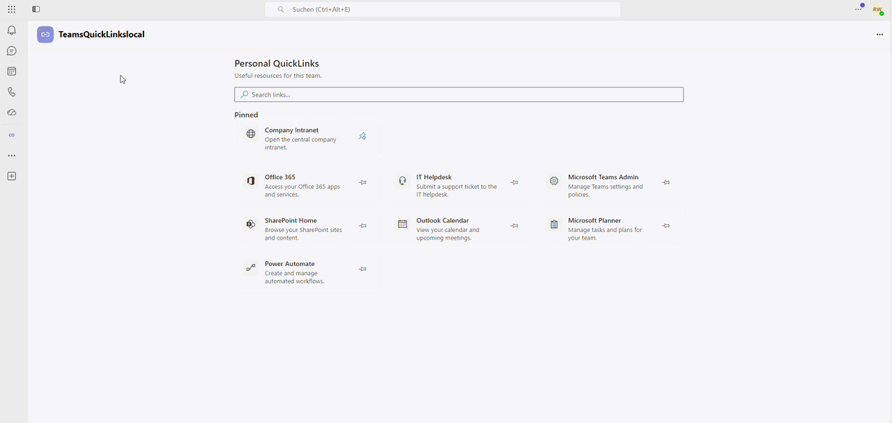
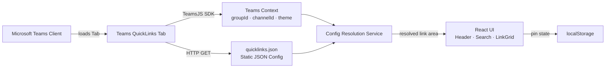
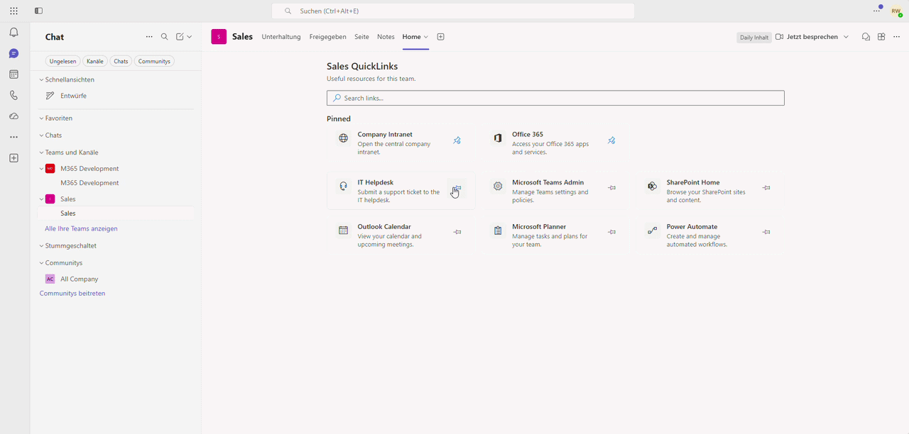
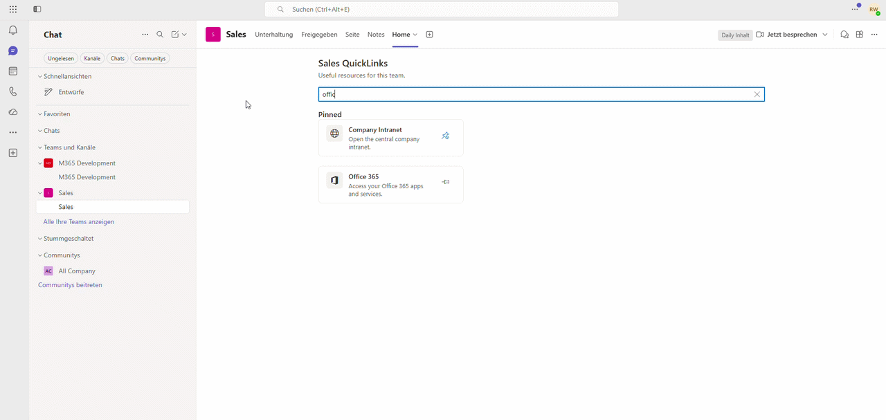

# Teams QuickLinks Tab — Context-Aware Quick Links for Microsoft Teams

## Summary

A lightweight Microsoft Teams Tab application that displays **context-aware quick links** based on the current team and channel. Links are resolved from a static JSON configuration, supporting team-level, channel-level, and default fallback link sets. Users can search, pin, and unpin links — all without a backend, database, or Microsoft Graph permissions.



## Tools and Frameworks


## Applies To

| Product / Platform | Version |
|--------------------|----------|
| Microsoft Teams | Current |
| Microsoft 365 Agents Toolkit (VS Code) | 6.0+ |
| Node.js | >= 20 |
| React | 19 |
| TypeScript | 5.4 |
| TeamsJS SDK | 2.0 |

## Why This Sample Exists

Organizations using Microsoft Teams often struggle with **scattered internal resources**: important links to portals, dashboards, wikis, and tools are buried in chat messages, bookmarks, or tribal knowledge. There is no built-in way to surface a curated, context-sensitive set of links per team or channel, especially without standing up a full backend or requiring admin-level Graph permissions.

**Teams QuickLinks** solves this by providing a zero-backend, JSON-driven tab that delivers the right links to the right team at the right time. It demonstrates how Teams Tab apps can render different content depending on the current Teams context using nothing more than a static configuration file and the TeamsJS SDK.

## Features

- **Context-aware link resolution** — different links per team, channel, or default fallback
- **Search** — filter links instantly with a built-in search box
- **Pin / Unpin** — users can pin their most-used links to the top; state is stored per user and context
- **Default pinned links** — administrators can pre-pin links via configuration
- **Teams theme support** — adapts to light, dark, and high-contrast themes
- **Fluent UI icons** — each link card can display a Fluent UI MDL2 icon
- **Responsive layout** — grid layout adapts to the available space
- **Zero-backend architecture** — no API, no database, no Microsoft Graph, no custom authentication
- **JSON-driven configuration** — a single `quicklinks.json` file controls everything

## Solution

| Solution | Author(s) |
|----------|-----------|
| Teams QuickLinks | [Rick Wenz](https://github.com/rwenz02) |

## Architecture

The app runs entirely in the browser as a Teams Tab. There is no backend API, no database, and no Microsoft Graph integration. Configuration is loaded from a static JSON file served alongside the frontend bundle.



### Resolution Flow

1. The tab initializes the TeamsJS SDK and reads `groupId`, `channelId`, `theme`, and `userObjectId`.
2. The static `quicklinks.json` configuration is fetched.
3. The **Config Resolution Service** selects the active link area using this priority:
   - **Channel match** — `teams[groupId].channels[channelId]` (if both IDs are present)
   - **Team match** — `teams[groupId]` (if only `groupId` is present)
   - **Default fallback** — `default` (e.g., in personal scope)
4. The resolved links, title, and description are rendered by the React UI.
5. Pin state is read from / written to `localStorage`, scoped per user and context.

### Tech Stack

| Layer | Technology |
|-------|------------|
| Frontend | React 19, TypeScript 5.4, Vite 6 |
| UI Components | Fluent UI React v8 |
| Teams Integration | TeamsJS SDK v2, Microsoft 365 Agents Toolkit |
| Server | Node.js + Express (serves the built frontend) |
| Configuration | Static JSON (`quicklinks.json`) |
| User Preferences | `localStorage` (pinned links) |
| Infrastructure | Azure App Service (Bicep) |

## Security & Permissions

- **No Microsoft Graph permissions required** — the app does not call Microsoft Graph.
- **No custom authentication, SSO, or OBO flow required** — the app reads only the Teams context provided to every tab by the TeamsJS SDK.
- **No personal data stored** — only an array of link IDs is persisted in `localStorage`.
- **No external API calls** — all data comes from the static JSON bundled with the app.
- **HTTPS enforced** — the Azure Bicep template sets `httpsOnly: true`.

The Teams manifest requests only the `identity` permission.

## Prerequisites

- [Node.js](https://nodejs.org/) >= 20
- [Visual Studio Code](https://code.visualstudio.com/)
- [Microsoft 365 Agents Toolkit](https://aka.ms/teams-toolkit) VS Code extension (v6.0.0+)
- A [Microsoft 365 developer account](https://developer.microsoft.com/microsoft-365/dev-program) with sideloading enabled

## Minimal Path to Awesome

1. Clone this repository (or download it) and open the sample folder in VS Code:

   ```shell
   git clone https://github.com/pnp/teams-dev-samples.git
   cd teams-dev-samples/samples/tab-context-quicklinks
   ```

2. Install dependencies:

   ```shell
   npm install
   ```

3. In the VS Code sidebar, click the **Microsoft 365 Agents Toolkit** icon and sign in with your Microsoft 365 account.

4. Press **F5** and select **Launch App in Teams (Edge)** or **Launch App in Teams (Chrome)**.

5. The toolkit will automatically:
   - Validate prerequisites (Node.js, M365 account, port availability on **3978** and **9239**)
   - Provision a local Teams app registration
   - Generate a trusted dev certificate for HTTPS
   - Build the frontend and start the dev server

6. When Teams opens, click **Add** to install the app.

The app should now load as a Teams Tab showing the quick links defined in `public/config/quicklinks.json`.

## Configuration (`quicklinks.json`)

All links are defined in a single static JSON file at `public/config/quicklinks.json`. At runtime, Vite serves this file from `/config/quicklinks.json`.

### Top-Level Structure

```json
{
  "default": { ... },
  "teams": { ... }
}
```

| Key | Required | Description |
|-----|----------|-------------|
| `default` | **Yes** | Fallback link set shown when no team- or channel-specific config matches. |
| `teams` | No | Object mapping `groupId` values to team-specific configurations. |

### Link Area Shape

Both `default` and each team/channel entry share the same shape:

```json
{
  "title": "Sales QuickLinks",
  "description": "Resources for the Sales department.",
  "links": [ ... ]
}
```

### Link Object Properties

| Property | Required | Description |
|----------|----------|-------------|
| `id` | Yes | Unique identifier. Used internally for pin state. |
| `title` | Yes | Display title shown on the link card. |
| `url` | Yes | URL to open (HTTPS recommended). |
| `description` | No | Short description shown below the title. |
| `icon` | No | [Fluent UI MDL2 icon name](https://developer.microsoft.com/fluentui#/styles/web/icons) (e.g., `Globe`, `Briefcase`). |
| `pinnedByDefault` | No | If `true`, the link appears pinned before user customization. |

### Team & Channel Configuration

Add team-specific links keyed by `groupId`, and optional channel-specific links nested under `channels`:

```json
{
  "teams": {
    "<groupId>": {
      "title": "Sales QuickLinks",
      "links": [ ... ],
      "channels": {
        "19:example-channel-id@thread.tacv2": {
          "title": "Enterprise Sales",
          "links": [ ... ]
        }
      }
    }
  }
}
```

> **Finding the `groupId`:** In Teams, right-click the team name → *Get link to team*. The link contains the `groupId`. Alternatively, query `/me/joinedTeams` in [Microsoft Graph Explorer](https://developer.microsoft.com/graph/graph-explorer).
>
> **Finding the `channelId`:** Right-click the channel name → *Get link to channel*. The URL contains the channel ID (e.g., `19:...@thread.tacv2`).

### Resolution Priority

Only **one** link set is active at a time — they do not merge:

1. **Channel-specific** — matching `groupId` + `channelId`
2. **Team-specific** — matching `groupId`
3. **Default** — fallback (always used in personal scope)

## Pinning Behavior

- Users can pin and unpin links. Pinned links appear in a dedicated section at the top.
- Pin state is stored in `localStorage` with the key: `quicklinks:pinned:{userObjectId}:{groupId}:{channelId}`
- Only link IDs are stored — no personal data.
- Pins are scoped per user and per context (team/channel/personal) and do **not** sync across devices.
- Links with `pinnedByDefault: true` appear pinned before any user customization.
- Newly added `pinnedByDefault` links are automatically appended to existing pin lists.
- Stored IDs that no longer match a link in the current configuration are silently dropped.



## Azure Deployment

### Provision

1. Open the **Microsoft 365 Agents Toolkit** sidebar in VS Code.
2. Under **Lifecycle**, click **Provision**.
3. Select your Azure subscription and resource group.
4. The toolkit deploys an Azure App Service defined in `infra/azure.bicep`.

### Deploy

1. In the Agents Toolkit sidebar, click **Deploy**.
2. The toolkit runs `npm run build` and deploys the output to Azure App Service.

### Publish

1. In the Agents Toolkit sidebar, click **Publish**.
2. The app package is submitted to your organization's Teams app catalog for admin approval.

## Project Structure

| Path | Purpose |
|------|---------|
| `assets/` | README images and GIFs used to demonstrate the sample |
| `src/index.ts` | Express/HTTPS server entry point |
| `src/Tab/App.tsx` | Root React component |
| `src/Tab/components/` | UI components (Header, LinkCard, LinkGrid, EmptyState) |
| `src/Tab/hooks/` | React hooks (Teams context, config loading, pinning, resolution) |
| `src/Tab/services/` | Config loading, resolution, link opening, storage |
| `src/Tab/utils/` | Deduplication, search, URL validation |
| `src/Tab/models/` | TypeScript interfaces |
| `src/Tab/enums/` | Loading state, config source enums |
| `public/config/quicklinks.json` | Static link configuration |
| `appPackage/manifest.json` | Teams app manifest |
| `infra/azure.bicep` | Azure App Service infrastructure |
| `m365agents.local.yml` | Local provisioning & deploy pipeline |
| `m365agents.yml` | Remote (Azure) provisioning pipeline |

## Available Scripts

| Command | Description |
|---------|-------------|
| `npm run dev` | Build frontend and start dev server with nodemon (auto-reload) |
| `npm run dev:teamsfx` | Same as `dev` but loads local environment config from `.localConfigs` |
| `npm run build` | Full production build (backend via tsup + frontend via Vite) |
| `npm run build:frontend` | Build only the Vite frontend |
| `npm run lint` | Run ESLint on the Tab source files |
| `npm run clean` | Remove the `dist/` output directory |

## Screenshots

| Scenario | Preview |
|----------|---------|
| Personal & channel tab |  |
| Search links |  |
| Pin / unpin links |  |

## Known Limitations

- In personal app scope (no `groupId`), only default QuickLinks are shown.
- Pinned links are stored in `localStorage` and do not sync across devices.
- The JSON configuration is baked into the build artifact — changes require redeployment.
- No admin UI for editing links.
- No Microsoft Graph integration.
- Team display names are not resolved dynamically.

## Possible Future Enhancements

- Teams SSO and OBO flow
- Resolve team/channel display names via Microsoft Graph
- Server-side or Graph-backed user preference storage
- Admin UI for editing link configuration
- SharePoint list-based configuration source
- Link analytics and click tracking
- Tenant-wide default configuration

## Version History

| Version | Date | Author | Comments |
|---------|------|--------|----------|
| 0.1.0 | May 2026 | Rick Wenz | Initial release |

## Disclaimer

**THIS CODE IS PROVIDED *AS IS* WITHOUT WARRANTY OF ANY KIND, EITHER EXPRESS OR IMPLIED, INCLUDING ANY IMPLIED WARRANTIES OF FITNESS FOR A PARTICULAR PURPOSE, MERCHANTABILITY, OR NON-INFRINGEMENT.**

---

## Authors

| Author | GitHub |
|--------|--------|
| Rick Wenz | [@rwenz02](https://github.com/rwenz02) |


